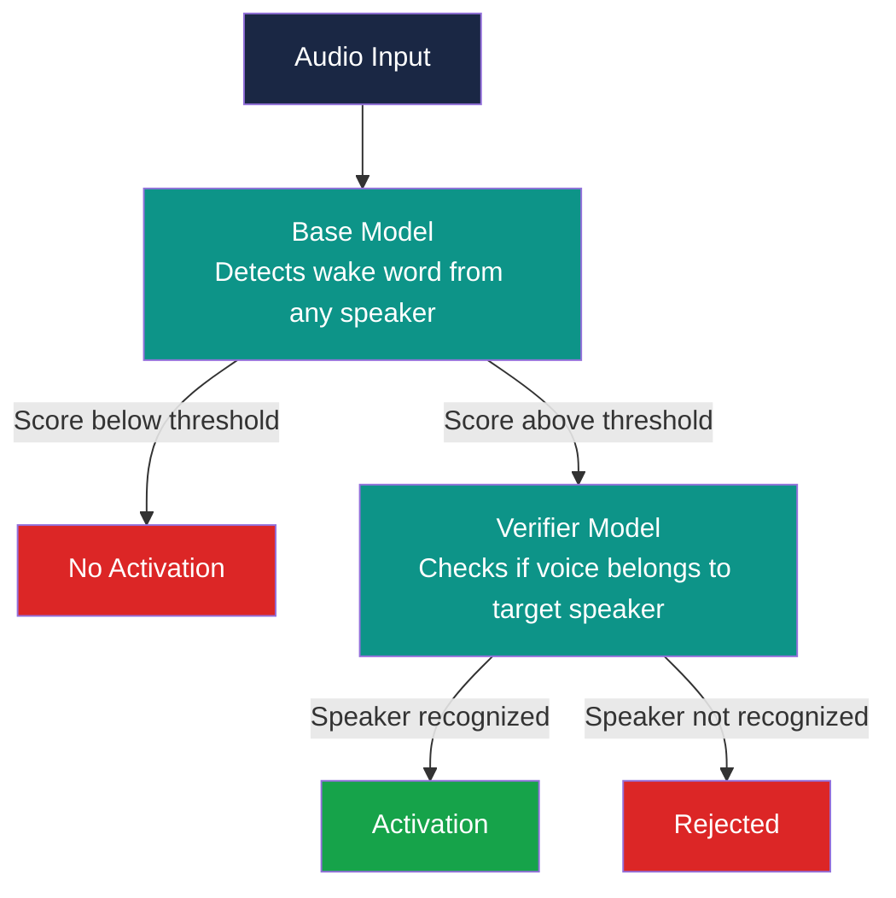

# Speech Interaction - SS 2026

This is the documentation for the Speech Interaction module of the 
Computer Science and Media degree at the Stuttgart Media University.

> [!NOTE]
> This is the English translation of the original German documentation.
> AI tools were used to translate the original German documentation.
> 🇩🇪 Die Originalversion kann hier gefunden werden: [German Documentation](/Dokumentation_Deutsch.md)

### Table of Contents

- [Goal](#goal)
- [Motivation](#motivation)
- [Constraints](#constraints)
- [Concept](#concept)
- [Implementation](#implementation)
- [Results](#results)
- [Conclusion](#conclusion)
- [References](#references)

## Goal

The goal of this project is to evaluate a Verifier Model in combination 
with the openWakeWord framework. The aim is to investigate whether such 
a model can reliably distinguish between an authorized target speaker 
and unknown speakers, and thus serve as a second security layer in a 
wake word system.

The central research question is:
> *Can a Verifier Model be used with certainty for secure user 
> verification?*

## Motivation

Modern voice assistants such as Amazon Alexa, Apple Siri, or Google 
Assistant are widely used today and are activated via a so-called wake 
word. A fundamental problem with these systems is that the base model 
only detects the wake word but does not distinguish between the 
authorized target speaker and other speakers. This can lead to 
unintended activations and potential security issues.

Against this background, this project investigates whether an additional 
Verifier Model can be used for secure user verification. The open-source 
library [openWakeWord](https://github.com/dscripka/openWakeWord) was 
chosen for implementation, as it provides a straightforward way to 
implement wake word detection and offers pre-trained models for various 
wake words. The insights gained are documented and may be used for 
future projects.

## Constraints

The project was carried out as part of the Speech Interaction module 
in the summer semester 2026 at Stuttgart Media University.

Technical framework:

| Component | Technology |
|-----------|------------|
| Framework | openWakeWord 0.6.0 |
| Language | Python 3.12 |
| Environment | Google Colab (T4 GPU) |
| Wake Word | "Alexa" |

The use of Google Colab was a deliberate decision, as local development 
on macOS led to compatibility issues with certain dependencies.

Audio recordings were made by the team members and additional 
participants, and had to be uniformly converted to the format `.wav`, 
16kHz, Mono for processing, as openWakeWord exclusively accepts this 
format.

### Limitations of the False Training Data

A known weakness of our experimental setup is the small number of 
negative training examples. For a robust distinction between the target 
speaker and non-target speakers, comparable scientific studies use 
several hundred speakers. Larcher et al., for example, use 300 speakers 
(143 female, 157 male) in the RSR2015 dataset to evaluate 
speaker verification systems. [[1]](#references)

In our project, recordings from only three people were available as 
negative examples for training. This is due to the limited time frame 
of a university project and should be taken into account when 
interpreting the results. Consequently, the results cannot be reliably 
compared with professional speaker verification systems.

## Concept

### System Architecture

The system consists of two consecutive stages:



The base model detects the wake word "Alexa" in a speaker-independent 
manner. If the score exceeds a defined threshold, the Verifier Model is 
activated, which additionally checks whether the voice belongs to the 
target speaker. Only if both models return a positive result will an 
activation occur.

### Experimental Setup

To evaluate the robustness of the system, three variants of the 
verifier were trained with different numbers of training samples 
(3, 6, and 10 positive clips).

Each variant was tested under the following conditions:

**1. Clean Recordings**

Controlled environment without interference as a baseline.

**2. Santa Barbara Corpus (False-Positive Stress Test)**

Hours of natural everyday conversations without the wake word "Alexa" 
are played back. We measure how often the system still triggers 
falsely. This tests the base model and verifier on realistic, 
naturally spoken speech.

### Metrics

| Metric | Description |
|--------|-------------|
| **False Accept Rate (FAR)** | False activation by an unknown speaker |
| **False Reject Rate (FRR)** | Target speaker is not recognized |

### Training Data

| Type | Content | Speaker |
|------|---------|---------|
| Positive (True) | Wake word "Alexa" | Target speaker (Sophie) |
| Negative (False) | Wake word "Alexa" | Unknown speakers (Julia, Alex) |
| Negative (False) | Other sentences, no wake word | Target speaker (Sophie) |

### Test Data

| Type | Content | Speaker |
|------|---------|---------|
| Positive (True) | Wake word "Alexa" | Target speaker (Sophie) |
| Negative (False) | Wake word "Alexa" | Unknown speakers (Lotte, Marie, Felix, Julia, Alex) |
| Negative (False) | Natural everyday conversations | Santa Barbara Corpus |

## Implementation

The complete implementation is documented in the corresponding notebook 
and can be followed there:  
[`Notebook: Evaluation.ipynb`](Evaluation.ipynb)

### Notebook Structure

The notebook is divided into four main sections:

**1. Installation and Imports**

openWakeWord and all required libraries are installed and imported.

**2. Data Preparation**

All audio files from the shared Google Drive folder "recordings" are 
read in and automatically converted to the format required by 
openWakeWord (`.wav`, 16kHz, Mono). The original folder structure is 
copied one-to-one into a new folder "recordings_converted", so that 
the original files are preserved.

**3. Verifier Training**

Three verifiers are trained with different numbers of positive training 
clips (3, 6, and 10). The negative clips remain identical. Each trained 
model is saved as a `.pkl` file in Drive.

**4. Evaluation and Threshold Analysis**

Each of the three verifiers is tested with threshold values from 0.7 
to 0.95. For each threshold, FAR and FRR are measured on the test data. 
Additionally, the Santa Barbara Corpus is used as a stress test for the 
False Accept Rate.

### Folder Structure

```text
speech_interaction/
├── evaluations/ (Santa Barbara Corpus)
├── recordings/ (Original recordings)
├── recordings_converted/ (Converted recordings)
├── models/ (Alexa Model from openWakeWord)
├── verifier/ (Trained Verifiers)
└── Evaluation.ipynb (Notebook)
```

## Results

### Threshold Analysis

The evaluation shows a clear trade-off between FAR and FRR depending 
on the chosen threshold:

| Threshold | FRR (Target Speaker) | FAR (Male Speakers) | FAR (Female Speakers) |
|-----------|---------------------|--------------------|-----------------------|
| 0.70 | 0% | 13.3% | 93.3% |
| 0.80 | 0% | 0% | 40% |
| 0.85 | 20% | 0% | 13.3% |
| 0.90 | 60% | 0% | 0% |
| 0.95 | 100% | 0% | 0% |


*Figure 1: FAR and FRR depending on the threshold*

At a threshold of 0.8, the best balance is achieved: the target speaker 
is reliably recognized (FRR = 0%). Male unknown speakers are completely 
rejected (FAR = 0%). The FAR for female speakers is still 40%, which 
can be attributed to similarities in voice characteristics.

From threshold 0.85 onwards, the FRR already rises to 20%, meaning the 
target speaker is no longer recognized in one out of five cases. At 
0.95, the target speaker is completely rejected, making the model 
unsuitable for practical use.

### Influence of Training Data Size

More positive training samples do not automatically lead to better 
results. This is consistent with the recommendation from openWakeWord 
itself, which explicitly advises against using too many positive 
examples, as the model is small and designed for only a few speakers.

### Santa Barbara Corpus

The test with the Santa Barbara Corpus revealed a measurable False 
Accept Rate even for natural everyday speech without the wake word, 
showing that the base model is occasionally triggered falsely. The 
verifier was able to filter out most of these false alarms.

## Conclusion

The research question of whether a Verifier Model can be used with 
certainty for secure user verification must be answered with **No**.

The verifier meaningfully reduces false alarms and represents a useful 
second security layer. However, it is not reliable enough to serve as a 
standalone security measure. In particular, the elevated FAR for female 
unknown speakers shows that the model reaches its limits when voice 
characteristics are similar.

The following conclusions can be drawn:

- A threshold of 0.8 offers the best compromise between security (FAR) 
  and usability (FRR)
- More positive training samples do not automatically improve results, 
  confirming the warning from openWakeWord
- The use case must be clearly defined: for comfort applications the 
  verifier is well suited, but it is not sufficient for 
  security-critical applications
- In the future, more negative training data from the target speaker as 
  well as synthetic data could improve results

## References

- dscripka, *openWakeWord* – GitHub repository including documentation 
  for Custom Verifier Models
- Ferro Filho, A. C., Brito, I. A., de Oliveira, E. A. M. & 
  Bittencourt, P. M. (2024). *Implementation and Applications of 
  WakeWords Integrated with Speaker Recognition: A Case Study.* 
  arXiv:2407.18985
- Du Bois et al., *Santa Barbara Corpus of Spoken American English*, 
  UC Santa Barbara / Linguistic Data Consortium
- Larcher, A., Lee, K. A., Ma, B. & Li, H. (2014). 
  *Text-dependent Speaker Verification: Classifiers, databases 
  and RSR2015.* Speech Communication, 60, 56–77. 
  [sciencedirect.com](https://www.sciencedirect.com/science/article/pii/S0167639314000156)
