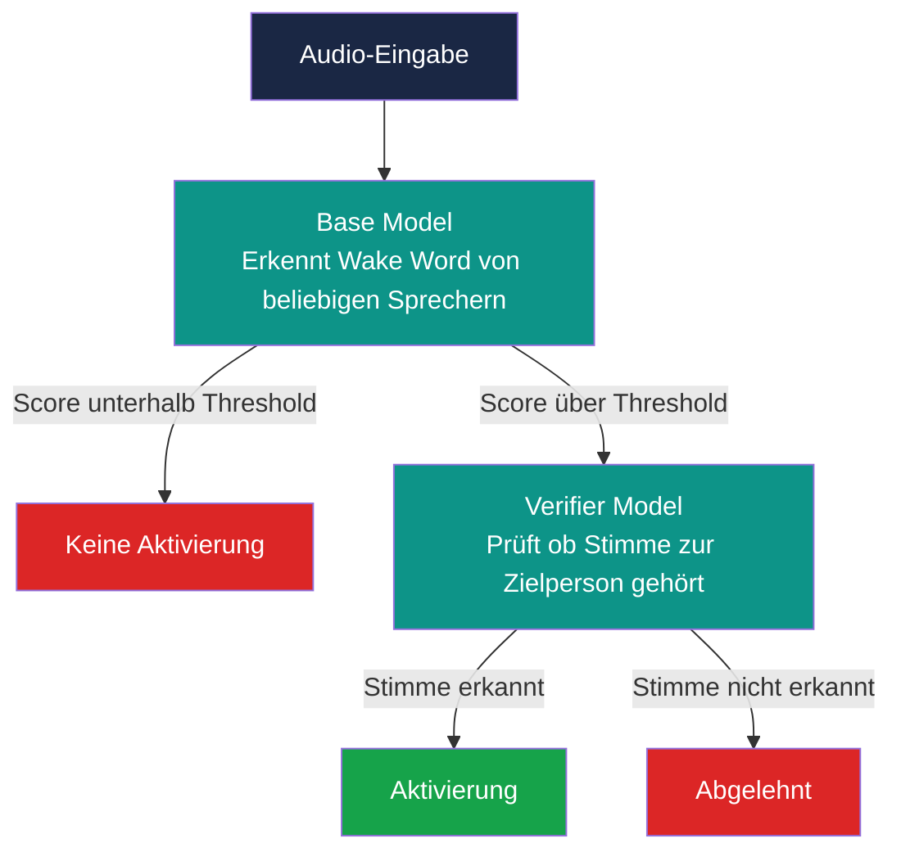
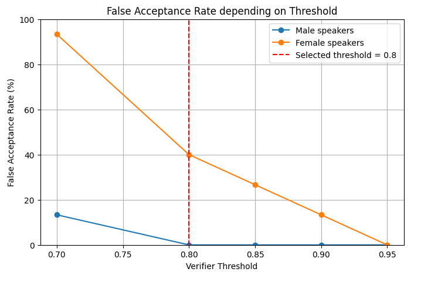

# Speech Interaction - SS 2026

Hierbei handelt es sich um die Dokumentation für das Modul Speech Interaction aus dem Studiengang Medieninformatik an
der Hochschule der Medien in Stuttgart.

> [!NOTE]
> This is the original version written in German.
> An English translation can be found here: [English Documentation](/Documentation_English.md)

### Inhaltverzeichnis

- [Ziel](#ziel)

- [Motivation](#motivation)

- [Randbedingungen](#randbedingungen)

- [Konzeptionierung](#konzeptionierung)

- [Implementierung](#implementierung)

- [Ergebnisse](#ergebnisse)

- [Fazit](#fazit)
  
- [Quellen](#quellen)

## Ziel

Ziel dieses Projekt ist die Evaluation eines Verifier Models in Kombination mit dem openWakeWord Framework. Es soll untersucht
werden, ob ein solches Modell zuverlässig zwischen der gesetzten Zielperson und fremden Sprechern unterscheiden kann und damit 
als zweite Sicherheitsstufe eingesetzt werden kann.

Die zentrale Forschungsfrage lautet:
> *Kann ein Verifier Model mit Gewissheit zu sicheren Nutzerverifikation eingesetzt werden ?*

## Motivation

Moderne Sprachassistenten wie AMazon Alexa, Apple siri oder Google Assistant sind heute weit verbreitet und werden über ein 
sogenanntes Wake Word aktiviert. Ein grundlegendes Problem dieser Systeme besteht darin, dass das Base Model lediglich das Wake Word 
erkennt, jedoch nicht zwischen der autorisierten Zielperson und anderen Sprechern unterscheidet. Dadurch kann es zu unbeabsichtigten 
Aktivierungen und somit potenziellen sicherheitsproblemen führen.

Vor diesem Hintegrund untersucht dieses Projekt, ob ein zusätzliches Verifier Model zu sicheren Nutzerverifikation eingesetzt werden 
kann. Für die Umsetzung wurde die Open-Source-Bibliothek openWakeWord [openWakeWord](https://github.com/dscripka/openWakeWord) gewähl, da sie eine einfache Implementierung der Wake-Word-Erkennung 
sowie vortrainierte Modelle für verschiedene Wake Words bereitstellt. Die gewonnenen Erkenntnisse werden dokumentiert und können ggf. 
für zukünftige Projekte genutzt werden.

## Randbedingungen

Das Projekt wurde im Rahmen des Moduls Speech Interaktion im Sommersemester 2026 an der Hochschule der Medien Stuttgart durchgeführt.

Technische Rahmenbedingungen:

| Komponente | Technologie |
|-----------|-------------|
| Framework | openWakeWord 0.6.0 |
| Sprache | Python 3.12|
| Umgebung | Google Colab (T4 GPU) |
| Wake Word | „Alexa" |

Die Nutzung von Google Colab wer eine bewusste Entscheidung, da lokale Entwicklungen auf macOS zu 
Kompatibilitätsproblemen mit Abhängigkeiten geführt haben.

Die Audioaufnahmen wurden von den Teammitgliedern sowie weiterern Personen selbst aufgezeichnet und 
mussten für die Verarbeitung einheitlich in das Format '.wav', '16kHz', Mono konvertiert werden, da openWakeWord
ausschließlich dieses Format akzeptiert.

### Limitierung der False Trainingsdaten

Eine bekannte Schwäche unseres Versuchsaufbaus ist die geringe anzahl an negativen Trainingsdaten. Für eine robuste Unterscheidung zwischen Zielsprecher 
und Fremdsprecher werden in vergleichbaren wissenschaftlichen Arbeiten mehrere hundert Sprecher verwendet.
Larcher et al. nutzen beispielsweise in RSR2015-Datensatz 300 Sprecher (143 weibliche, 157 männliche) um die Speaker-Verification-Systeme zu evaluieren.
[[1]](#quellen)

In unserem Projekt standen für das Training lediglich Aufnahmen von drei Personen als negative Beispiele zur Verfügugn. Dies ist im Rahmen eines
Universitätsprojekts mit begrenztem Zeitrahmen entsprechen einzuordenen. Somit können die Ergbnisse nicht sicher mit professionellen 
Sprecher-Verifikations-System verglichen werden. 

## Konzeptionierung

### System-Architektur

Das System besteht aus zwei aufeinanderfolgenden Stufen:

Das Base Model erkennt das Wake Word "Alexa" sprecherunabhängig. 
Überschreitet der Score einen definiereten Threshold, wird das Verifier Model aktiviert, das zusätzlich prüft 
ob die Stimme zur Zielperson gehört. Nur wenn beide Modelle positiv ausschlage, erfolgt eine Aktivierung.

### Versuchsaufbau

Um die Robustheit des Systems zu evaluieren, wurden drei Varianten des Verifiers mit unterschiedlich
vielen Trainingsdaten trainiert (3, 6 und 10 positive Clips).

Jede Variante wurde unter diesen Bedingungen getestet:

**1.Saubere Aufnahmen**

Kontrollierte Umgebung ohne Störfaktor als Baseline.

**2.Santa Barbara Corpus (False-Positive-Stresstest)**

Stunden natürlicher Alltagsgespräche ohne das Wake Word "Alexa" werden abgespielt. Gemessen
wird, wie oft das System trotzdem fälschlich auslöst. Damit wird das Base Model und der 
Verifier auf realistischer gesprochene Sprache getestet.

### Messgrößen

| Metrik | Beschreibung |
|--------|-------------|
| **False-Accept-Rate (FAR)** | Fehlaktivierung durch fremde Stimme |
| **False-Reject-Rate (FRR)** | Zielstimme wird nicht erkannt |

### Trainingsdaten

| Typ | Inhalt | Sprecher |
|-----|--------|----------|
| Positiv (True) | Wake Word „Alexa" | Zielperson (Sophie) |
| Negativ (False) | Wake Word „Alexa" | Fremde Sprecher (Julia, Alex) |
| Negativ (False) | Andere Sätze, kein Wake Word | Zielperson (Sophie) |

### Testdaten

| Typ | Inhalt | Sprecher |
|-----|--------|----------|
| Positiv (True) | Wake Word „Alexa" | Zielperson (Sophie) |
| Negativ (False) | Wake Word „Alexa" | Fremde Sprecher (Lotte, Marie, Felix, Julia, Alex) |
| Negativ (False) | Natürliche Alltagsgespräche | Santa Barbara Corpus |

## Implementierung

Die vollständige Implementierung ist im entsprechenden Notebook dokumentiert und 
dort nachvollziehbar:
[`Notebook: Evaluation.ipynb`](Evaluation.ipynb)

### Aufbau des Notebooks

Das Notebook ist in vier Hauptbereiche gegliedert:

**1. Installation und Imports**

openWakeWord und alle benötigten Bibliotheken werden installiert und importiert.

**2. Datenvorbereitung**

Alle Audiodatein aus dem gemeinsamen Google Drive Ordner "recordings" werden eingelesen und 
automatisch in das von openWakeWord verlangte Format konvertiert ('.wav', '16kHz', Mono). 
Die ursprüngliche Ordnerstruktur wird dabei eins zu eins in einem neuen Ordner "recordings_converted" 
kopiert, sodass die Originaldateienn erhalten bleiben.

**3. Verifier Training**

Es werden drei Verifier mit unterschiedlich vielen positiven Trainngsclips trainiert (3, 6 und 10). Die
negativen Clips bleiben dabei identisch. Jedes trainierte Modell wird als '.pkl'-Datei im Drive gespeichert.

**4. Evaluation und Threshold-Analyse**

Jeder der drei Verifier wird mit ThresholdWerten von 0.7 bis 0.95 getestet. Für jeden Threshold werden FAR und FRR
auf den Testdaten gemessen. Zusätzlich wird der Santa Barbara Corpus als Stresstest für die False-Accept-Rate verwendet.

### Ordnerstruktur
>*bitte noch ergänzen wenn Struktur aufgeräumt*

## Ergebnisse

### Threshold-Analyse

Die Auswertung zeigt eine klare Trad-off zwishcen FAR und FRR in Abhängigkeit vom gewählten Thr3eshold:

| Threshold | FRR (Zielperson) | FAR (männl. Sprecher) | FAR (weibl. Sprecher) |
|-----------|-----------------|----------------------|----------------------|
| 0.70 | 0% | 13.3% | 93.3% |
| 0.80 | 0% | 0% | 40% |
| 0.85 | 20% | 0% | 13.3% |
| 0.90 | 60% | 0% | 0% |
| 0.95 | 100% | 0% | 0% |

*Abbildung 1: FAR und FRR in Abhängigkeit vom Threshold*

Bei einem Threshold von 0.8 wird die beste Balance erziehlt: 
Die Zielperson wird zuverlässig erkannt (FRR = 0%). Die männlichen Fremdsprecher werden hier vollständig abgelehtn (FAR= 0%).
Die FAR für weibliche Sprecher beträgt hier noch 40%, das lässt sich jedoch zurück führen auf eine Ähnlichkeit in der Stimmcharakteristik.

Ab Threshold 0.85 steigt der FRR bereits auf 20 %, was bedeutet, dass die Zielperson in einem von fünf Fällen nicht mehr erkannt wird.
Bei 0.95 wird die Zielperson vollständig abgelehtn, somit kann man schließen dass das Modell für den praktischen Einsatz unbrauchbar ist.

### Einfluss der Trainingsdatenmenge

Mehr positive Trainingsdaten führen nicht automatisch zu besseren Ergebnissen. Dies deckt sich mit der Empfehlung von 
openWakeWord selber, das explizit davon abrät, zu viele positive Beisepile zu verwenden, da dass Modell klein und auf wenig Sprecher
ausgelegt ist.

### Santa Barbara Corpus

Der Test mit dem Santa Barbara Corppus ergab eine messbare False-Accept-Rate auch bei natürlicher Alltagssprache ohne das 
Wake Word, was zeigt dass das Base Model gelegentlich fälschlicherweise aktiviert wird. Der Verifier konnte diese Fehlalarme
in den meisten Fällen herausfiltern.

## Fazit

Die Forschungsfrage, oob ein Verifier Model mit GEwissheit zur sicheren Nutzverifikation eingesetzt werden kann, muss mit **Nein** 
beantwortet werden.

Der Verifier reduziert Fehlalarme sinnvoll und dtellt eine zweite Sicherheitsstufe dar. Er ist jedoch nicht zuverlässig genu, 
um als alleinige Sicherheitsmaßnahke zu gelten. Vorallem die erhöhte FAR bei weiblichen Fremdsprechern zeigt, dass das Modell bei ähnlichen
Stimmcharakteristiken an seine GRenzen stößt.

Folgende Erkenntnisse lassen sich festhalten:

- Ein Threshold von 0.8 bietet den besten Kompromiss zwischen Sicherheit (FAR) und Nutzerfreundlichkeit (FRR)
- Mehr positive Trainingssamples verbessern die Ergbnisse nicht automatisch, dies bestätigt die Warnung von openWakeWord
- Der Use-Case muss genau definiert werden, da für eine Komfortanwendung ist der Verifier gut geeignt, für sicherheitskritische Anwendungen
  jedoch nicht ausreichend
- Zukünftig könnten mehr negative Trainingsdaten der Zielperson sowie synthetische Daten die Ergebnisse verbessern

## Quellen
- dscripka, *openWakeWord* – GitHub-Repository inkl. Dokumentation 
  zu Custom Verifier Models
- Ferro Filho, A. C., Brito, I. A., de Oliveira, E. A. M. & 
  Bittencourt, P. M. (2024). *Implementation and Applications of 
  WakeWords Integrated with Speaker Recognition: A Case Study.* 
  arXiv:2407.18985
- Du Bois et al., *Santa Barbara Corpus of Spoken American English*, 
  UC Santa Barbara / Linguistic Data Consortium
- Larcher, A., Lee, K. A., Ma, B. & Li, H. (2014). 
  *Text-dependent Speaker Verification: Classifiers, databases 
  and RSR2015.* Speech Communication, 60, 56–77. 
  [sciencedirect.com](https://www.sciencedirect.com/science/article/pii/S0167639314000156)
