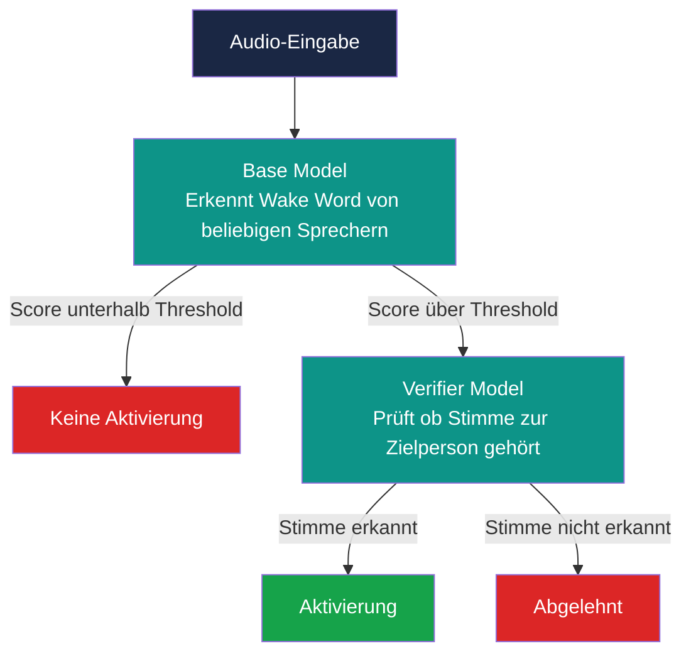

# Speech Interaction - SS 2026

Hierbei handelt es sich um die Dokumentation für das Modul Speech Interaction aus dem Studiengang Medieninformatik an
der Hochschule der Medien in Stuttgart.

> [!NOTE]
> This is the original version written in German.
> An English translation can be found here: [English Documentation](/Documentation_English.md)

### Inhaltverzeichnis

- [Ziel](#ziel)

- [Motivation](#motivation)

- [Randbedingungen](#randbedingungen)

- [Konzeptionierung](#konzeptionierung)

- [Implementierung](#implementierung)

- [Ergebnisse](#ergebnisse)

- [Fazit](#fazit)
  
- [Quellen](#quellen)

## Ziel

Ziel dieses Projekt ist die Evaluation eines Verifier Models in Kombination mit dem openWakeWord Framework. Es soll untersucht
werden, ob ein solches Modell zuverlässig zwischen der gesetzten Zielperson und fremden Sprechern unterscheiden kann und damit 
als zweite Sicherheitsstufe eingesetzt werden kann.

Die zentrale Forschungsfrage lautet:
> *Kann ein Verifier Model mit Gewissheit zu sicheren Nutzerverifikation eingesetzt werden ?*

## Motivation

Moderne Sprachassistenten wie AMazon Alexa, Apple siri oder Google Assistant sind heute weit verbreitet und werden über ein 
sogenanntes Wake Word aktiviert. Ein grundlegendes Problem dieser Systeme besteht darin, dass das Base Model lediglich das Wake Word 
erkennt, jedoch nicht zwischen der autorisierten Zielperson und anderen Sprechern unterscheidet. Dadurch kann es zu unbeabsichtigten 
Aktivierungen und somit potenziellen sicherheitsproblemen führen.

Vor diesem Hintegrund untersucht dieses Projekt, ob ein zusätzliches Verifier Model zu sicheren Nutzerverifikation eingesetzt werden 
kann. Für die Umsetzung wurde die Open-Source-Bibliothek openWakeWord [openWakeWord](https://github.com/dscripka/openWakeWord) gewähl, da sie eine einfache Implementierung der Wake-Word-Erkennung 
sowie vortrainierte Modelle für verschiedene Wake Words bereitstellt. Die gewonnenen Erkenntnisse werden dokumentiert und können ggf. 
für zukünftige Projekte genutzt werden.

## Randbedingungen

Technische Rahmenbedingungen:

| Komponente | Technologie |
|-----------|-------------|
| Framework | openWakeWord |
| Sprache | Python |
| Umgebung | Google Colab (T4 GPU) |
| Wake Word | „Alexa" |

## Konzeptionierung

### System-Architektur

Das System besteht aus zwei aufeinanderfolgenden Stufen:

### Versuchsaufbau & Testbedingungen

Um die Robustheit des Systems zu evaluieren, wurden zwei Testbedingungen definiert:

**1.Saubere Aufnahmen**
Kontrollierte Umgebung ohne Störfaktor als Baseline.

**2.Santa Barbara Corpus (False-Positive-Stresstest)**
Stunden natürlicher Alltagsgespräche ohne das Wake Word "Alexa" werden abgespielt. Gemessen
wird, wie oft das System trotzdem fälschlich auslöst. Damit wird das Base Model und der 
Verifier auf realistischer gesprochene Sprache getestet.

### Messgrößen

| Metrik | Beschreibung |
|--------|-------------|
| **Erkennungsrate** | Zielstimme wird korrekt erkannt |
| **False-Accept-Rate (FAR)** | Fehlaktivierung durch fremde Stimme |
| **False-Reject-Rate (FRR)** | Zielstimme wird nicht erkannt |

### Trainingsdaten
>*muss noch ergänzt und korrigiert werden*

#### Positive Clips (True)
- Aufnahmen der Zielstimme mit dem Wake Word „Alexa"
- Mind. 3–5 Aufnahmen pro Zielsprecher
- Format: `.wav`, 16kHz, Mono

#### Negative Clips (False)
- **Fremde Sprecher:** Andere Personen sprechen das Wake Word „Alexa"
- **Zielsprecher:** Die Zielperson spricht beliebige andere Sätze 
  (kein Wake Word)
- Format: `.wav`, 16kHz, Mono

### Testdaten

#### Positive Testdaten
- Separate, neue Aufnahmen der Zielstimme mit dem Wake Word
- Getestet unter sauberen Bedingungen und mit Hintergrundgeräuschen

#### Negative Testdaten
- Fremde Sprecher sprechen das Wake Word „Alexa"
- Zielperson spricht beliebige andere Sätze (kein Wake Word)
- Santa Barbara Corpus als Stresstest für die False-Accept-Rate

## Implementierung
>*wird noch ergänzt wenn coding part durch*

### Voraussetzungen 
- Google Colab (mit T4 GPU)
- Google Drive (gemeinsamer Ordner)

### Ordnerstruktur
>*bitte noch ergänzen wenn Struktur aufgeräumt*

## Ergebnisse
>*wird ergänzt wenn coding part durch*

**Vorläufige Erkenntnisse:**
- Mehr positive Samples sorgen nicht automatisch für bessere Ergebnisse
- Der Verifier reduziert Fehlalarme sinnvoll, ersetzt aber keine 
  echte Sicherheitsmaßnahme
- Der Use-Case muss genau definiert und die Trainingsdaten 
  entsprechend angepasst werden

## Fazit
> *wird nach Abschluss der Evaluation vollständig ergänzt*

## Quellen
- dscripka, *openWakeWord* – GitHub-Repository inkl. Dokumentation 
  zu Custom Verifier Models
- Ferro Filho, A. C., Brito, I. A., de Oliveira, E. A. M. & 
  Bittencourt, P. M. (2024). *Implementation and Applications of 
  WakeWords Integrated with Speaker Recognition: A Case Study.* 
  arXiv:2407.18985
- Du Bois et al., *Santa Barbara Corpus of Spoken American English*, 
  UC Santa Barbara / Linguistic Data Consortium
