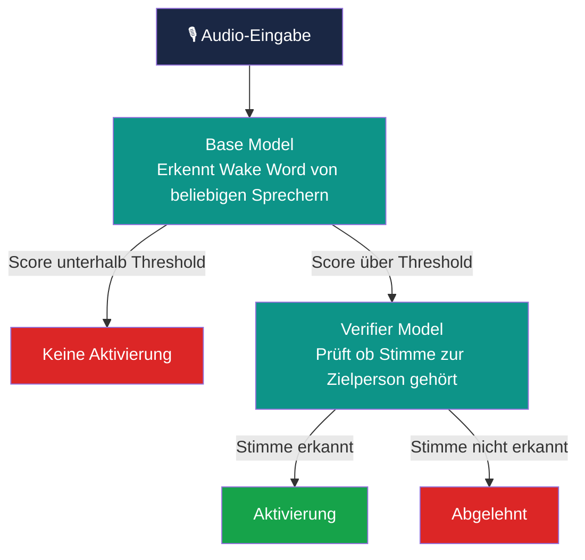

# Evaluation eines Verifier Models mit openWakeWord

**Speech Interaction - Abschlussprojekt**
> *muss noch Kürzel ergänzen*
Sophie Barke (sb...)
Alex Quadflieg (aq...)
Julia Herold (jh308)

## Projektbeschreibung

Moderne Sprachassistenten wie Amazon Alexa, Apple Siri oder Google Assistant sind in vielen Haushalten und Arbeitsumgebungen aktiv. Diese Systeme werden durch ein sogenanntes Wake Word aktiviert, ein kurzes Schlüsselwort wie „Alexa", das das Gerät aus dem Standby-Modus weckt.

Ein grundlegendes Problem dieser Systeme ist, dass das Wake Word von beliebigen Personen im Raum ausgesprochen werden kann. Das Base Model unterscheidet nicht zwischen der autorisierten Zielperson und anderen Sprechern, was zu ungewollten Aktivierungen und potenziellen Sicherheitsproblemen führen kann.

> *ab hier noch prüfen auf Korrektheit*
Ziel dieses Projekts ist es, eine zweite Verifikationsstufe zu evaluieren: ein sogenanntes Verifier Model. Dieses Modell wird spezifisch auf die Stimme einer Zielperson trainiert und prüft nach jeder Aktivierung durch das Base Model, ob die erkannte Stimme tatsächlich zur autorisierten Person gehört. Nur wenn beide Modelle eine positive Bewertung liefern, wird das System final aktiviert.

Im Rahmen des Projekts werden mehrere Verifier Modelle trainiert und unter verschiedenen Bedingungen evaluiert – sowohl mit sauberen Aufnahmen als auch mit Hintergrundgeräuschen. Als Messgrößen dienen die False-Accept-Rate (Fehlaktivierungen durch fremde Stimmen) und die False-Reject-Rate (verpasste Aktivierungen der Zielstimme).

---

## Forschungsfrage
> Kann ein Verifier Model mit Gewissheit zur sicheren Nutzerverifikation eingesetzt werden?

---

## Tech-Stack

| Komponente | Technologie |
|-----------|-------------|
| Framework | openWakeWord |
| Sprache | Python |
| Umgebung | Google Colab |
| Wake Word | „Alexa" |

---

## System-Architektur
> *überprüfen*

---

# Methodik & Versuchsaufbau

### Testbedingungen

**1. Saubere Aufnahmen**
Kontrollierte Bedingungen ohne Störfaktoren als Baseline

**3. Santa Barbara Corpus (False-Positive-Test)**
Stunden natürlicher Alltagsgeräusche ohne das Wake Word "Alexa", wir messen wie oft das System trotzdem fälschlich auslöst. 

### Messgrößen

| Metrik | Beschreibung |
|--------|-------------|
| **Erkennungsrate** | Zielstimme wird korrekt erkannt (bekannte Sprecher) |
| **False-Accept-Rate** | System aktiviert bei falscher Stimme (Fehlalarm) |
| **False-Reject-Rate** | Zielstimme wird nicht erkannt (verpasste Aktivierung) |

---

## Daten

### Trainingsdaten

#### Positive Clips (True)
- Aufnahmen der Zielstimme, die das Wake Word „Alexa" ausspricht
- Mind. 3–5 Aufnahmen pro Zielsprecher
- Format: `.wav`, 16kHz, Mono

#### Negative Clips (False)
- **Fremde Sprecher:** Andere Personen sprechen das Wake Word „Alexa"
- **Zielsprecher:** Die Zielperson spricht beliebige andere Sätze 
  (kein Wake Word)
- Format: `.wav`, 16kHz, Mono

---

### Testdaten

#### Positive Testdaten (True)
- Neue Aufnahmen der Zielstimme mit dem Wake Word „Alexa"
- Nicht identisch mit den Trainingsdaten – separate Aufnahmen

#### Negative Testdaten (False)
- **Fremde Sprecher:** Andere Personen sprechen das Wake Word „Alexa"
- **Zielsprecher:** Die Zielperson spricht beliebige andere Sätze
- **Santa Barbara Corpus:** Stunden natürlicher Alltagsgespräche 
  ohne das Wake Word als Stresstest für die False-Accept-Rate

---

## Setup 

### Voraussetzungen 
- Google Colab (mit T4 GPU)
- Google Drive (gemeinsamer Ordner)

### Ordnerstruktur
> *wird noch ergänzt*
---

## Ergebnisse & Fazit

> *wird nach abschluss der Evaluation vollständig ergänzt*

**Vorläufige Erkenntnisse:**
- Mehr positive Samples sorgen nicht automatisch für bessere Ergebnisse
- Verifier Model reduziert Fehlalarme sinnvoll, erstezen aber keine echte Sicherheitsmaßnahmen
- Der Use-Case muss genau definiert und die Trainingsdaten entsprechend angepasst werden

---

## Quellen
- dscripka, *openWakeWord* – GitHub-Repository inkl. Dokumentation 
  zu Custom Verifier Models
- Ferro Filho, A. C., Brito, I. A., de Oliveira, E. A. M. & 
  Bittencourt, P. M. (2024). *Implementation and Applications of 
  WakeWords Integrated with Speaker Recognition: A Case Study.* 
  arXiv:2407.18985
- Quelle: Du Bois et al., Santa Barbara Corpus of Spoken American 
English, UC Santa Barbara / Linguistic Data Consortium

